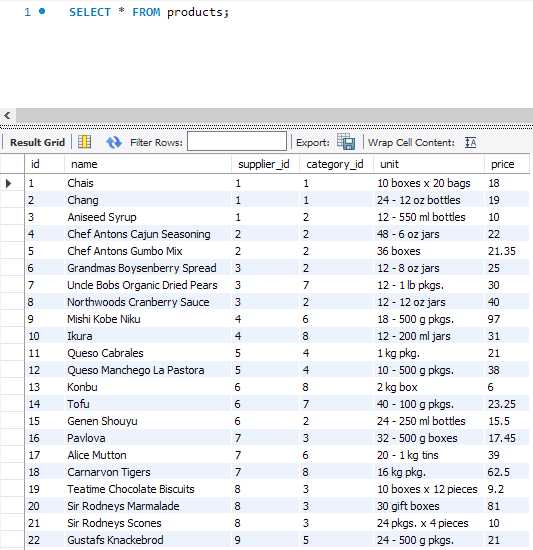
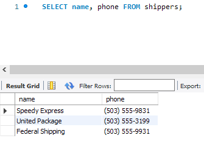
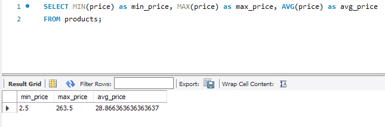
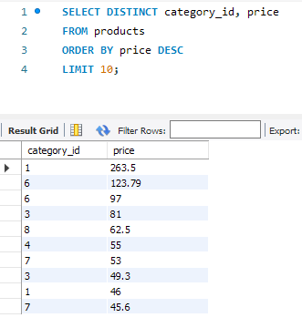
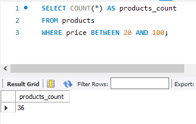
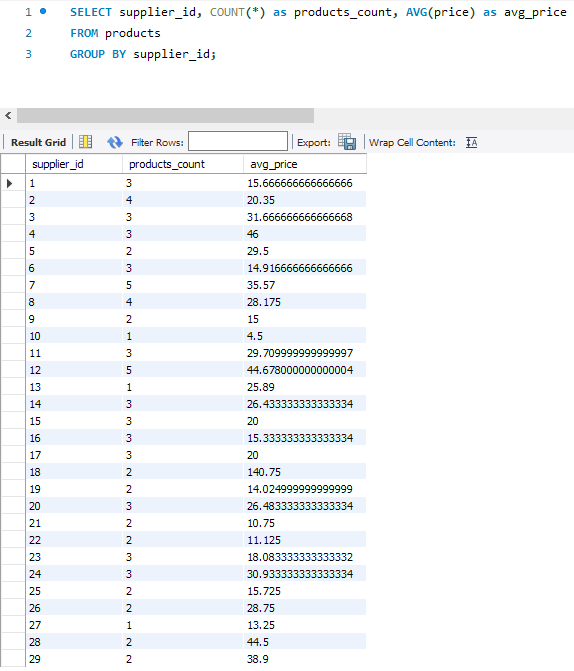

# Relational Databases DQL commands HW-03

## P1

```sql
SELECT * FROM products;
```



```sql
SELECT name, phone FROM shippers;
```



## P2

```sql
SELECT MIN(price) as min_price, MAX(price) as max_price, AVG(price) as avg_price FROM products;
```



## P3

```sql
SELECT DISTINCT category_id, price 
FROM products 
ORDER BY price DESC 
LIMIT 10;
```


## P4

```sql
SELECT COUNT(*) AS products_count 
FROM products 
WHERE price BETWEEN 20 AND 100;
```


## P5

```sql
SELECT supplier_id, COUNT(*) as products_count, AVG(price) as avg_price 
FROM products 
GROUP BY supplier_id;
```

